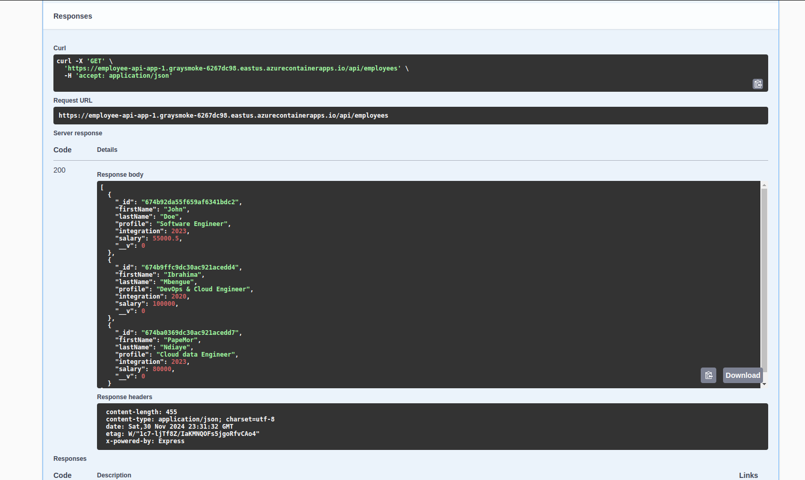

# Cloud Lab DevOps - Employees API on Azure

## **Description**

Dans ce lab, nous avons conçu une petite application de gestion d'employés en utilisant **Node.js** pour le backend et **EJS** pour l'interface graphique. Le déploiement de l'application a été entièrement automatisé grâce à un pipeline **GitHub Actions**. 

Ce pipeline couvre les étapes de : 
- **Construction de l'image Docker**,
- **Publication de l'image sur Docker Hub**, 
- **Déploiement sur Azure Container Apps**.

Les secrets nécessaires (Docker Hub et Azure) ont été configurés dans **GitHub Actions** pour garantir la sécurité. Enfin, les ressources Azure ont été créées via le portail Azure pour héberger l'application.

---

## **Étapes Suivies**

### **1. Développement de l'Application**

- L'application a été développée en utilisant :
  - **Node.js** : pour le backend.
  - **EJS (Embedded JavaScript)** : pour le rendu côté client.

L'application permet de gérer des employés via une interface graphique et expose également des endpoints API.

---

### **2. Création du Pipeline GitHub Actions**

Un fichier **YAML** a été écrit pour automatiser le processus de déploiement. Voici les principales étapes incluses dans le pipeline :

#### **a. Build de l'Image Docker**
   - L'image Docker de l'application est construite à l'aide de la commande `docker build`.
   - Cette image est prête à être poussée vers un registre Docker.

#### **b. Push vers Docker Hub**
   - L'image Docker est poussée dans le **registre Docker Hub**.
   - Les identifiants (nom d'utilisateur et mot de passe) sont stockés dans les **secrets GitHub** pour des raisons de sécurité.

#### **c. Déploiement sur Azure**
   - Le pipeline utilise les identifiants Azure configurés dans les **secrets GitHub** pour déployer l'image Docker directement sur **Azure Container Apps**.

---

### **3. Configuration des Secrets dans GitHub Actions**

- Les **secrets Docker Hub** suivants ont été ajoutés :
  - `DOCKER_USERNAME`: Nom d'utilisateur Docker Hub.
  - `DOCKER_PASSWORD`: Mot de passe Docker Hub.

- Les **secrets Azure** suivants ont été ajoutés :
  - `AZURE_CLIENT_ID`: Identifiant du client Azure.
  - `AZURE_TENANT_ID`: Identifiant du tenant Azure.
  - `AZURE_SUBSCRIPTION_ID`: Identifiant de la souscription Azure.
  - `AZURE_CLIENT_SECRET`: Secret du client Azure.

---

### **4. Création des Ressources sur Azure**

Les ressources nécessaires pour héberger l'application ont été créées via le **portail Azure** :

- **Azure Container Apps** : pour déployer l'application.
- La configuration du déploiement a été finalisée en sélectionnant l'image Docker depuis Docker Hub et en renseignant les variables d'environnement nécessaires.

---

### **5. Résultat Final**

Après le déploiement, l'application est accessible via les liens suivants :

- **Documentation de l'API (Swagger)** :  
  [https://employee-api-app-1.graysmoke-6267dc98.eastus.azurecontainerapps.io/api-docs/](https://employee-api-app-1.graysmoke-6267dc98.eastus.azurecontainerapps.io/api-docs/)
  

- **Interface Administrateur** :  
  [https://employee-api-app-1.graysmoke-6267dc98.eastus.azurecontainerapps.io/admin](https://employee-api-app-1.graysmoke-6267dc98.eastus.azurecontainerapps.io/admin)

  
  

---

**Fin du README.**
